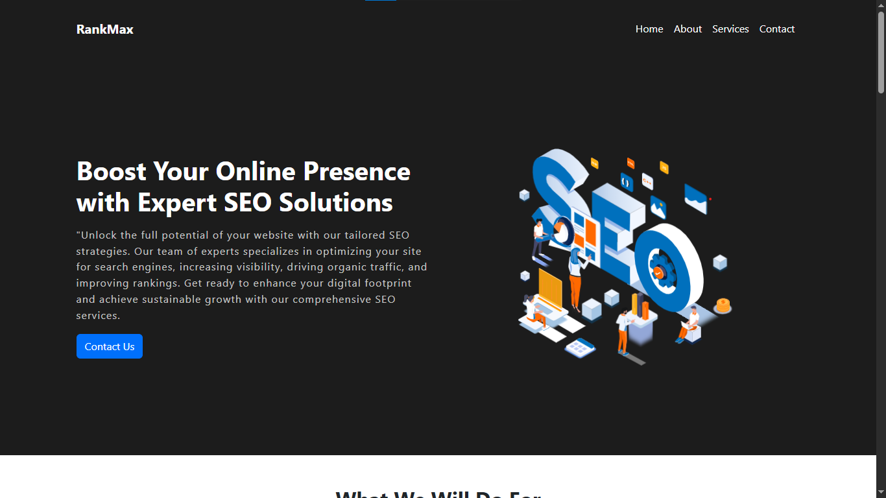

# 🌐 RankMax SEO Service Landing Page

A fully responsive, modern landing page for **RankMax** — an SEO consultancy offering AI-powered optimization, content writing, technical audits, and link-building services designed to boost organic growth and ROI.

## 📸 Preview

🔗 **Live Demo**: https://rank-max.netlify.app/

---

## 📸 Hero Section

- **Headline:** “Maximise Your Business Growth With AI SEO at scale”
- **CTA Button:** “Get Started” / “Book a Call”
- **Trust Stats:** Shows organic impressions, clicks, and revenue metrics

---

## 📌 Key Sections & Features

### 1. What We Deliver
- **SEO Strategy** – Integrated content & SEO planning
- **Content Writing** – Market-aligned, CMS-ready articles
- **Image Creation** – Branded visuals with accessibility text
- **Technical SEO** – Monthly audits with actionable reports
- **Link Building** – Curated guest posts and PR placements

### 2. Why Choose RankMax?
- **Market Leadership** – Build value through SEO dominance
- **Streamlined Growth** – One-stop SEO department alternative
- **Higher ROI** – Achieve sustainable organic results (4×+)

---

## 🛠️ Tech Stack

- **HTML5**
- **CSS3** (Grid / Flexbox)
- **Bootstrap 5** for responsive layout
- **Vanilla JavaScript** for interactive elements

---
## 💡 Using This Repo

This repo is intended solely for portfolio and educational purposes. Please give credit if you reference or reuse the code

Clone the repo: git clone https://github.com/askdanish144/RankMax-seo-service-landing-page.git
   
---
   
## ✨ Author

Crafted with attention to detail by **Danish Ali – Full Stack Developer & Graphic Designer**

GitHub: https://github.com/askdanish144

---

## 📬 Want a website like this?

I'm available to build responsive, business-focused websites tailored to any industry, whether you're a startup, local business, or growing brand.
➤ Email me at `askdanish144@gmail.com` to start a conversation.
